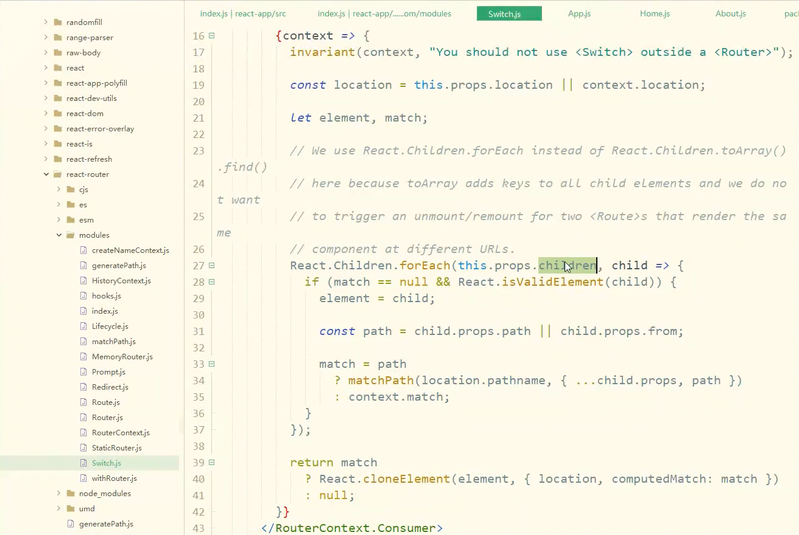
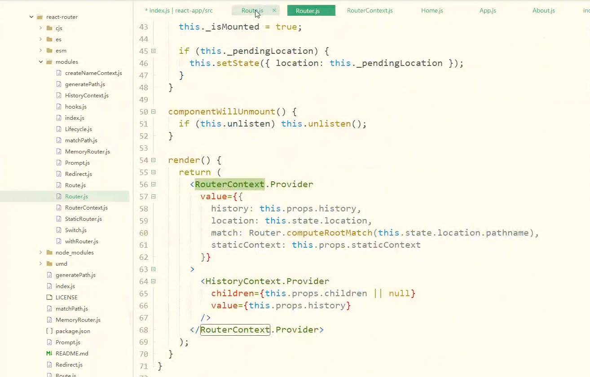
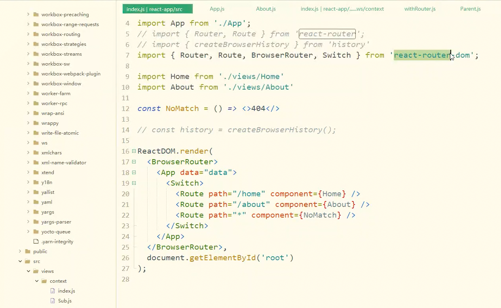
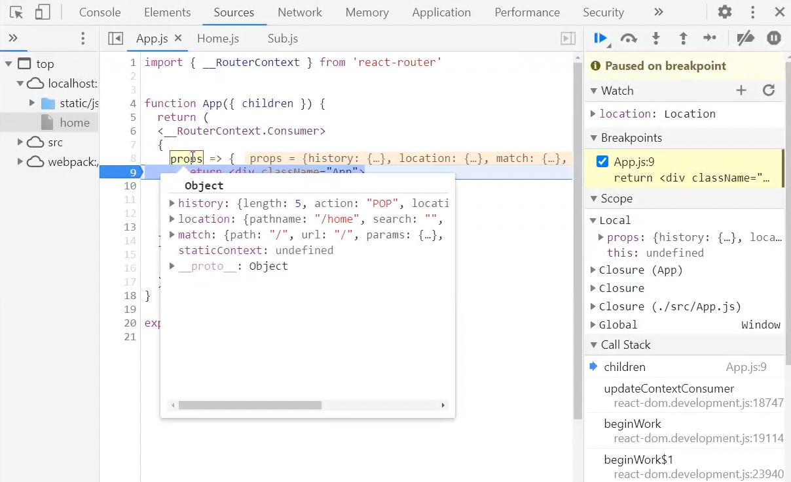

#### 底层核心原理

1. 在<strong>History</strong>路由模式下，均机遇html5新增的history API， <strong>pushState</strong>，<strong>replaceState</strong>，用法如下：
```javascript
history.pushState(state, title, url);
history.replaceState(state, title, url);
```

即跳转到URL路径（与当前页面在同一个域，形如一个网站的loaction.pathname部分），指定新页面的标题title，但是浏览器目前都忽略这个值，因此这里一般使用null，state为关联新地址的状态对象。

二者异同点：
> pushState会增加一条浏览记录，而replaceState会替换当前历史记录。
> 两者均不会刷新当前页面，也不会发生真正的跳转。而是仅仅改变了地址栏URL

2. 在Hash路由模式下，基于location.hash = pathStr来改变网站路径。pathStr代表网址中#号后面直到search的部分。与history<strong>不同</strong>的是，如果两次赋值一样的时候，并不会触发hashchange和popstate方法。

#### vue-router

1. vue-router实现相对没有那么难理解。首先从使用方式入手，在vue实例初始化时候，会注入路由的router模块：
```javascript
import Vue from 'vue';
import router from './router/index';

// ...

new Vue({
  el: '#app',
  router,
  store, // ++
  components: { App },
  template: '<App/>'
});
```
2. 在根vue组件，可以看到router-view和router-link两种使用方法

```html
<template>
  <div id="app">
    <div class="header">
      <!-- 使用 router-link 组件来导航. -->
      <!-- 通过传入 `to` 属性指定链接. -->
      <!-- <router-link> 默认会被渲染成一个 `<a>` 标签 -->
      <router-link to="/">Home</router-link>
      <router-link to="/about">About</router-link>
      <router-link to="/login">Login</router-link>
    </div>
    <!-- 路由出口 -->
    <!-- 路由匹配到的组件将渲染在这里 -->
    <router-view></router-view>
<!--    <transition name="slide-left">-->
<!--      <router-view></router-view>-->
<!--    </transition>-->
  </div>
</template>
```

紧接着看下路由实例的声明：
```javascript
import Vue from 'vue';
import VueRouter from 'vue-router';
import routes from './routers';     // 路由配置表
// 0. 如果使用模块化机制编程，导入Vue和VueRouter，要调用 Vue.use(VueRouter)
Vue.use(VueRouter);

// 1. 定义 (路由) 组件。
// 可以从其他文件 import 进来
// import Home from '../views/Home';
// 使用路由懒加载
// const About = () => import('../views/About.vue');
// const Login = () => import('../components/Login.vue');
// const Layout = () => import('../views/Layout.vue');
// const Bar = { template: '<div>bar</div>' };

// 2. 定义路由
// 每个路由应该映射一个组件。 其中"component" 可以是
// 通过 Vue.extend() 创建的组件构造器，
// 或者，只是一个组件配置对象。
// const routes = [
//   { path: '/', component: () => import(/* webpackChunkName: "Home" */ '../views/Home.vue') },
//   { path: '/about', component: About },
//   { path: '/bar', component: Bar },
//   { path: '/login', component: Login },
//   { path: '/layout', component: Layout }
// ];

// 3. 创建 router 实例，然后传 `routes` 配置
// 你还可以传别的配置参数, 不过先这么简单着吧。
const router = new VueRouter({
  // mode: 'history', // 默认 hash 模式
  routes // (缩写) 相当于 routes: routes
});

router.beforeEach((to, from, next) => {
  // if (to.name !== 'Login' && !isAuthenticated) next({ name: 'Login' })
  // else next()

  next();
});

router.afterEach((to, from) => {
  // ...
  console.log('from：', from);
  // if (window.ActiveXObject || 'ActiveXObject' in window) {
  //   CollectGarbage();
  // }
  setTitle(to, router.app);
  window.scrollTo(0, 0);
});

export default router;
// 4. 创建和挂载根实例。
// 记得要通过 router 配置参数注入路由，
// 从而让整个应用都有路由功能
// import router from './router/index'
// new Vue({
//   el: '#app',
//   router,
//   components: { App },
//   template: '<App/>'
// })

```

3. 项目中还需要定义路由和路由组件的关系，进阶还可以配置异步路由组件：

```javascript
const About = () => import('../views/About.vue');
const Bar = { template: '<div>bar</div>' };

export default [
  {
    path: '/',
    name: 'home',
    // title: '首页',
    meta: {
      title: '首页'
    },
    component: () => import(/* webpackChunkName: "Home" */ '../views/Home.vue')     // webpack异步组件
  },
  { // 测试
    path: '/test',
    name: 'test',
    title: 'test',
    meta: {
      title: '测试页面'
    },
    component: () => {
      // require(['@/components/diy-tool-box/index.vue'], resolve)
      import('../views/Home.vue');
      // require(['@/module/map/MapConsole.vue'], resolve);
    }
  },
  {
    path: '/about',
    meta: {
      title: '首页'
    },
    component: About
  },
  {
    path: '/bar',
    meta: {
      title: '首页'
    },
    component: Bar
  },
  {
    path: '/login',
    meta: {
      title: '登录'
    },
    component: () => import(/* webpackChunkName: "Home" */ '../components/login.vue')
  }
];
```

以上我们就完成了从路由表、路由组件的配置，到vue实例的路由注入，再加上vue组件使用路由的整个初始化过程。

------------------

##### 路由源码浅析

Vue.use方法接收了一个install方法的对象或者类作为参数，例如注入一个全局的modal组件：

```javascript
import Modal from './modal.vue';

const MyModal = {
    install(Vue){ // install 会被传入Vue 参数
        Vue.component('Modal', Modal);
    }
}

Vue.use(MyModal);
// 这样就可以在template 中直接使用<Modal></Modal> 了。
```

同理这种思路，沿袭到VueRouter根文件中：

```javascript
import { install } from './install'
...
export default class VueRouter {
    static install: () => void
    ...
}
VueRouter.install = install
```

继续追溯到install.js:

```javascript
import View from './components/view'
import Link from './components/link'

export function install(Vue) {
...
    Vue.mixin({
        beforeCreate() { // 这里使得_route 属性具备响应能力
        Vue.util.defineReactive(this, '_route', this._router.history.current)
    },
    destroyed() {}
  })
}
...
// Vue.$router实例声明
Object.defineProperty(Vue.prototype, '$router', {
    get () { return this._routerRoot._router }
})

Object.defineProperty(Vue.prototype, '$route', {
    get () { return this._routerRoot._route }
})
// 走到下面两行代码已经水落石出了，这也是我们引入vue-router 后
// 就能全局使用<router-view> 和<router-link> 的原因
Vue.component('RouterView', View)
Vue.component('RouterLink', Link)
}
```
不难得出结论，vue-router 是Vue 应用的一个全局组件，一次注册便可以处处使用，且所有的vue 实例都能访问到Vue 原型对象上的$router 和$route 对象，因此在使用函数式跳转时是及其方便的。

那我们继续，在实例化VueRouter 时，有routes 和mode 参数

```javascript
const router = new VueRouter({
    mode: 'history', // 默认为hash模式
    routes: []
})
```
进入构造器constuctor:

```javascript
constructor (options: RouterOptions = {}) {
    ...
    this.fallback =
        mode === 'history' && !supportsPushState && options.fallback !== false
    if (this.fallback) {
        mode = 'hash'
    }
    switch (mode) {
        case 'history':
        this.history = new HTML5History(this, options.base)
        break
        case 'hash':
        this.history = new HashHistory(this, options.base, this.fallback)
        break
        case 'abstract':
        this.history = new AbstractHistory(this, options.base)
        break
    }
}
```

可以看出，基于三种mode，vue-router 分别用三个对象来初始化this.history：HTML5History，HashHistory，AbstractHistory。而后续的几类路由跳转（go, push...）方法，也是调用了this.history 的方法。具体可以再挖掘vue router源代码，在这里就不过多的贴出了。

#### react-router

写法和vue比较类似，先给出一段初始化执行代码：

```javascript
import React from 'react';
import ReactDOM from 'react-dom';
import './index.css';
import App from './App';
import { Router, Route } from 'react-router';
import { createBrowserHistory } from 'history';

// 假设这里有两个组件home和about
import Home from './views/Home';
import About from './views/About';
// 使用history模式
const history = createBrowserHistory();

ReactDOM.render(
    <Router history={history}>
        <App>
            <Route path="/home" component={Home}/>
            <Route path="/about" component={About} />
            <Route path="/xxx" component={
                props => {
                    return 
                    <App1>
                        <Route path="子路由">
                    </App1>
                }
            }/>
        </App>
    </Router>,
    document.getElementById('root');
);

```
也可以参考这个，一个完整的路由组件用法，可以参考这个贴图：


按照惯例，分析下react router的源码，router入口文件：


接下来看下switch.js路由匹配的方式。通过遍历React.Children，如果child路由合法，那么就构造返回一个element


上面提到过，在路由switch.js，提供了一个<strong>RouterContext</strong>。这个可以理解为一个闭包上下文环境，引用环境的provider可以向consumer提供指定的数据和方法。那我们看看源码是如何呈现的：
在react Router.js中，像环境提供了一些公共的实例，比如<strong>history</strong>，<strong>location</strong>等等。其中history的push方法可以完成前端路由的跳转，以及通过state传值给子组件。


而在Route.js中，作为consumer方，直接在context中获取传递的history使用：


那么此时，我们如果想利用context这个方法，来完成Router Context props的传递，该如何做呢？首先完善代码，使用BrowserRouter和Switch：


那么回到App.js，核心在于接受router context的传入，下面给出高阶函数的写法：
```javascript
import { __RouterContext } from 'react-router';

function App({children}) {
    return (
        <div className="App">
            { children }
        </div>
    );
}

function ctx(Component) {
    return props => 
    <__RouterContext.Consumer>
        {   // context为router context环境提供的
            context => <Component {...context}{...props}></Component>
        }
    </__RouterContext.Consumer>
}

// 返回一个App的高阶函数
export default ctx(App);
```
跑一下代码，就可以看到注入效果了：
